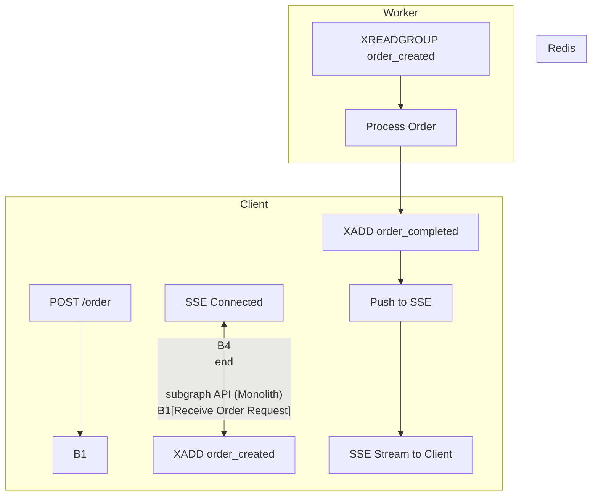
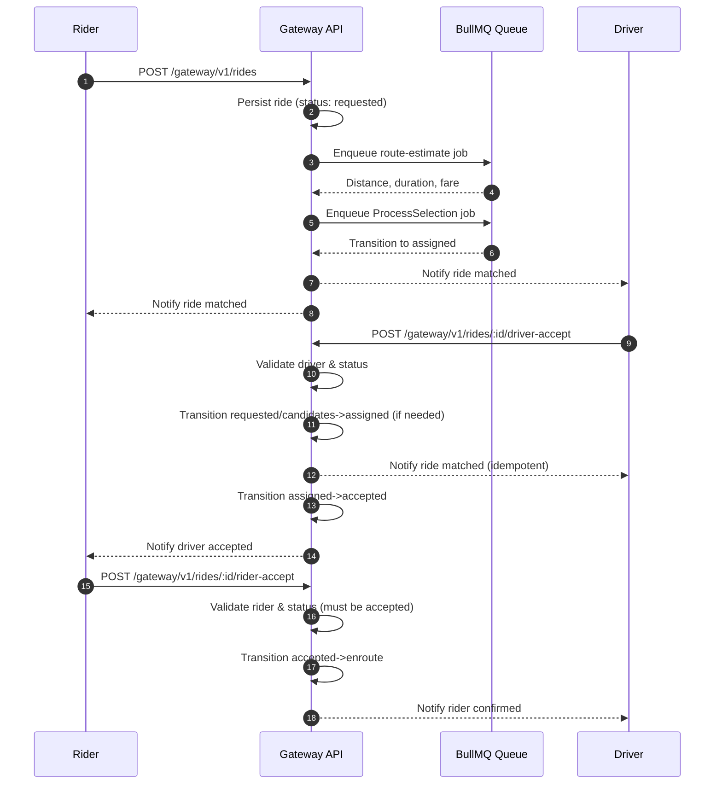
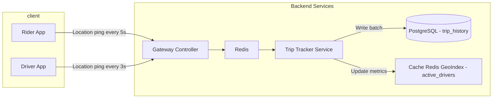

# Project Nebengjek

Nebengjek is an application to unite rider/consumer and driver for ride haling service, with following logic

Nebengjek Logic

1. user/rider activate order ⇒ being informed of all drivers within range
2. driver ⇒ always send location data
3. user select specific driver
4. driver being informed if he/she is selected ⇒ driver will be informed about: user/rider location, destination, possibility whether easy or difficult
5. driver will submit whether he/she accept/agree to take the user
6. if driver agree driver will pick the user
7. user and driver go to destination
8. along the way to destination, both will be informed of rate (3000 / km )
9. Upon arrive in destination, trx complete and driver will charge the user and apply discount
10. Nebengjek apps will take 5% fee of trx in no. 9

Assumption :

driver can switch on/off of location activation

## Environment Variables

| Variable                      | Description                                                                                                           |
| ----------------------------- | --------------------------------------------------------------------------------------------------------------------- |
| `SMS_SERVICE_URL`             | Base URL for the SMS provider endpoint that delivers OTP messages.                                                    |
| `OTP_SIMULATION_ACCESS_TOKEN` | Static token that authorizes access to the OTP simulation SSE stream. Leave unset to disable the simulation endpoint. |

## Architecture Design Document

1. High-Level Design (HLD)

1.1 Overview

This architecture simplifies the system by using a Monolithic API that connects to:
• Redis for two purposes:
• Geospatial indexing (Redis GEO)
• Event bus (Redis Streams)
• PostgreSQL / MySQL for persistent relational storage
• Background Workers that process Redis Streams asynchronously
• SSE (Server-Sent Events) for notifying clients in real-time

The architecture prioritizes simplicity, fast development, and moderate scalability.

1.2 HLD Diagram (Mermaid)

<!-- prettier-ignore -->
:::mermaid
graph TD
  A[Client Mobile/Web] --> B[Monolith API Service]
  B --> C[Redis]
  B --> D[PostgreSQL - MySQL]
  C --> E[Background Workers]
  C -->|GEO| B
  C -->|Stream| E
  E -->|Stream| C
  B --> F[SSE Clients]
:::

⸻

2. Low-Level Design (LLD)

2.1 Components and Responsibilities

2.1.1 Monolith API
• Handles HTTP requests (e.g., POST /order)
• Writes geospatial data with GEOADD
• Emits events to Redis Streams using XADD
• Maintains SSE connections to push updates to clients

2.1.2 Redis
• Stores location data using GEOADD, queried via GEORADIUS / GEOSEARCH
• Streams events like order_created and order_completed

2.1.3 Background Workers
• Read messages from Redis Streams via XREADGROUP
• Perform business logic (e.g., match driver, process payments)
• Write back results to another Redis Stream or Pub/Sub

2.1.4 SSE Manager (in Monolith)
• Holds client connections in memory (Map<userId, Response>)
• Pushes messages to clients when events are consumed from Redis Stream

2.2 LLD Diagram (Mermaid)

<!-- prettier-ignore -->

⸻

3. Technology Stack

Component Technology
API Server NestJS / Express
Event Bus Redis Streams
Geospatial Index Redis GEO
Persistence PostgreSQL / MySQL
Background Jobs Node.js Worker
Realtime Updates Server-Sent Events

# Ride Creation-to-Acceptance Flow

<!-- prettier-ignore -->

<!-- prettier-ignore -->

