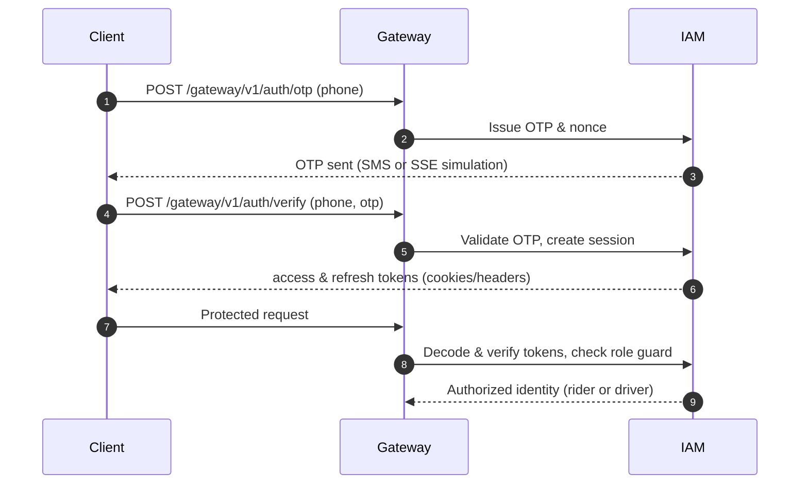
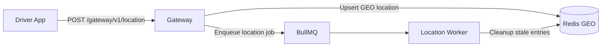
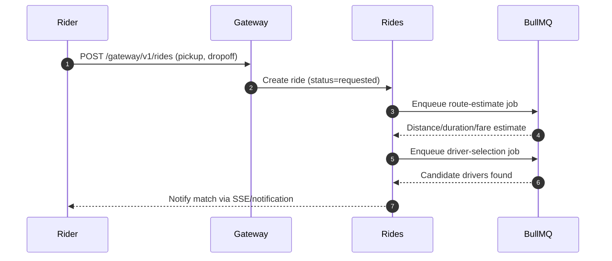

# Nebengjek (neb-lite)

Nebengjek is a monolithic ride-hailing backend built with NestJS. It couples a thin HTTP/SSE edge with Redis-backed queues and a relational store to keep ride operations simple while still supporting realtime updates, payments, and notifications.

## High-Level Design (HLD)
- **Monolith API (NestJS)** exposes HTTP and SSE endpoints for all clients.
- **Redis** provides geospatial indexing for active drivers and Streams for asynchronous jobs/events.
- **Relational database (PostgreSQL/MySQL)** persists identities, rides, payments, and audit history.
- **Background workers** consume Redis Streams and queues for matching, tracking, payments, and notifications.
- **Server-Sent Events (SSE)** push OTP simulation and ride status updates without dedicated WebSocket infra.

### HLD Diagram
<!-- prettier-ignore -->
:::mermaid
graph TD
  A[Client Mobile/Web] --> B[Monolith API]
  B --> C[Redis]
  B --> D[PostgreSQL / MySQL]
  C --> E[Background Workers]
  C -->|GEO| B
  C -->|Streams| E
  E -->|Streams| C
  B --> F[SSE Clients]
:::

## Core Modules (LLD Overview)

### 1) Gateway Module
- Single public entrypoint under `/gateway/v1/*` for riders and drivers.
- Orchestrates authentication, location updates, ride lifecycle, and payment/webhook callbacks via domain services.
- Publishes realtime events to SSE streams (ride status, OTP simulation) and delegates long-running tasks to Redis queues.

### 2) IAM Module
- OTP-based authentication that issues access/refresh tokens; logout and token-rotation flows are supported.
- Role-aware guards/decorators enforce rider vs. driver authorization on endpoints.
- Centralizes token parsing and cookie handling so downstream handlers receive verified identities.

### 3) Location Module
- Accepts periodic driver pings, writing coordinates to Redis GEO for proximity search.
- Background processors clean up stale drivers and manage BullMQ queues for location updates.
- Exposes nearby-driver lookups used by ride matching and ETA calculations.

### 4) Rides Module
- **Ride management:** create/cancel rides, collect driver candidates, and manage status transitions (requested → assigned → accepted → enroute → completed/cancelled).
- **Ride tracking:** buffer trip locations, flush batched paths to persistent storage, and refresh metrics/geo caches.
- **Ride payment:** create payment intents, publish outbox events to PSPs, ingest webhooks, and settle rider/driver balances.

### 5) Notifications Module
- Unified publisher for OTPs, ride events, and rider/driver alerts.
- Supports SSE subscriptions and can extend to SMS/push/email channels.

## Key LLD Flows

### 1) Authentication & Authorization
<!-- prettier-ignore -->


### 2) Driver Updates Location
<!-- prettier-ignore -->


### 3) Rider Creates a Ride
<!-- prettier-ignore -->


### 4) Driver Starts the Trip
- Driver accepts the assignment (`POST /gateway/v1/rides/:id/driver-accept`), transitioning the ride to **accepted** and notifying the rider.
- When the driver arrives and begins the ride (`POST /gateway/v1/rides/:id/start`), the ride transitions to **enroute** and tracking starts, pushing status updates via SSE.

### 5) Driver Completes the Trip
- Driver ends the ride (`POST /gateway/v1/rides/:id/complete`), capturing final route metrics.
- Trip-tracking worker flushes buffered locations to persistent storage and triggers fare finalization.
- Notifications module emits completion events to rider and driver channels.

### 6) Payment Process
<!-- prettier-ignore -->
```mermaid
sequenceDiagram
  autonumber
  participant API as Gateway/Rides API
  participant DB as DB
  participant OB as Outbox Producer
  participant PSP as Payment Provider
  participant WH as Webhook Handler

  API->>DB: Create PaymentIntent(status=PENDING)
  API->>DB: Insert outbox event (PaymentRequested)
  OB->>DB: Poll outbox (FOR UPDATE SKIP LOCKED)
  OB->>PSP: POST /payments (idempotency key)
  PSP-->>OB: Ack accepted
  OB->>DB: Mark outbox sent; intent=status PROCESSING
  PSP-->>WH: Webhook (payment.succeeded/failed)
  WH->>DB: Upsert intent status; store webhook inbox
  WH-->>API: Emit PaymentSucceeded/Failed events
```

## Technology Stack
- **Framework:** NestJS (Express) with modular domain boundaries.
- **Queues/Events:** Redis Streams + BullMQ for job orchestration and outbox polling.
- **Geospatial:** Redis GEO commands for nearby-driver discovery.
- **Datastores:** PostgreSQL or MySQL for transactional data; optional MongoDB for trip history.
- **Realtime:** Server-Sent Events (SSE) for OTP simulation and ride/driver status updates.
- **Logging:** `nestjs-pino` for structured application logs.

## Environment Variables
| Variable | Description |
| --- | --- |
| `SMS_SERVICE_URL` | Base URL for the SMS provider endpoint that delivers OTP messages. |
| `OTP_SIMULATION_ACCESS_TOKEN` | Static token authorizing access to the OTP simulation SSE stream. Leave unset to disable the simulation endpoint. |
| `TRIP_TRACKING_FLUSH_INTERVAL_MS` | Interval (ms) controlling how often the trip-tracking job flushes accumulated locations to persistent storage. Defaults to `60000` when unset. |
