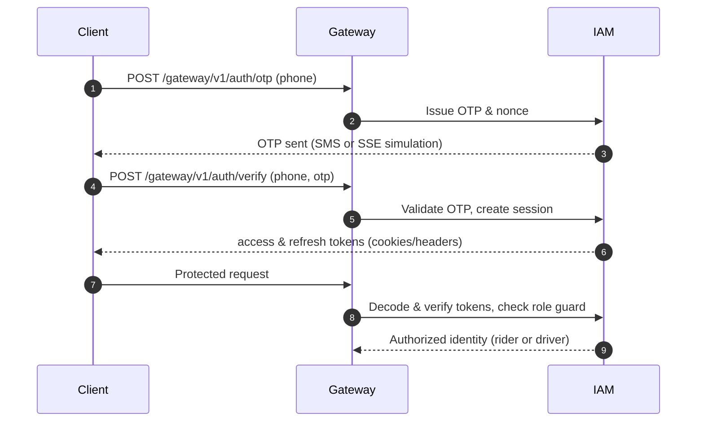
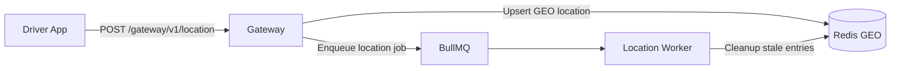
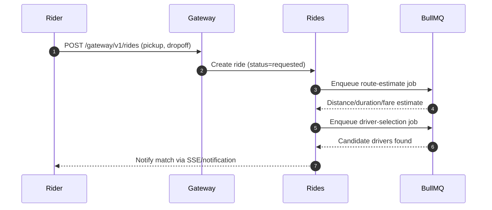
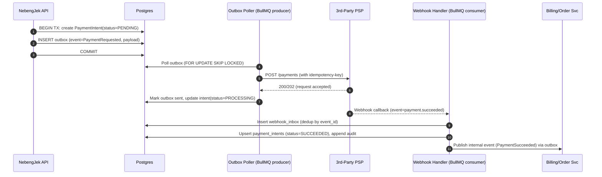

# Nebengjek (neb-lite)

Nebengjek is a monolithic ride-hailing backend built with NestJS. It couples a thin HTTP/SSE edge with Redis-backed queues and a relational store to keep ride operations simple while still supporting realtime updates, payments, and notifications.

## High-Level Design (HLD)

- **Monolith API (NestJS)** exposes HTTP and SSE endpoints for all clients.
- **Redis** provides geospatial indexing for active drivers and Streams for asynchronous jobs/events.
- **Relational database (PostgreSQL)** persists identities, rides, payments, and audit history.
- **Background workers** consume Redis Streams and queues for matching, tracking, payments, and notifications.
- **Server-Sent Events (SSE)** push OTP simulation and ride status updates without dedicated WebSocket infra.

### HLD Diagram

<!-- prettier-ignore -->
:::mermaid
graph TD
  A[Client Mobile/Web] --> B[Monolith API]
  B --> C[Redis]
  B --> D[PostgreSQL]
  C --> E[Background Workers]
  C -->|GEO| B
  C -->|Streams| E
  E -->|Streams| C
  B --> F[SSE Clients]
:::

## Core Modules (LLD Overview)

### 1) Gateway Module

- Single public entrypoint under `/gateway/v1/*` for riders and drivers.
- Orchestrates authentication, location updates, ride lifecycle, and payment/webhook callbacks via domain services.
- Publishes realtime events to SSE streams (ride status, OTP simulation) and delegates long-running tasks to Redis queues.

### 2) IAM Module

- OTP-based authentication that issues access/refresh tokens; logout and token-rotation flows are supported.
- Role-aware guards/decorators enforce rider vs. driver authorization on endpoints.
- Centralizes token parsing and cookie handling so downstream handlers receive verified identities.

### 3) Location Module

- Accepts periodic driver pings, writing coordinates to Redis GEO for proximity search.
- Background processors clean up stale drivers and manage BullMQ queues for location updates.
- Exposes nearby-driver lookups used by ride matching and ETA calculations.

### 4) Rides Module

- **Ride management:** create/cancel rides, collect driver candidates, and manage status transitions (requested → assigned → accepted → enroute → completed/cancelled).
- **Ride tracking:** buffer trip locations, flush batched paths to persistent storage, and refresh metrics/geo caches.
- **Ride payment:** create payment intents, publish outbox events to PSPs, ingest webhooks, and settle rider/driver balances.

### 5) Notifications Module

- Unified publisher for OTPs, ride events, and rider/driver alerts.
- Supports SSE subscriptions and can extend to SMS/push/email channels.

## Key LLD Flows

### 1) Authentication & Authorization

<!-- prettier-ignore -->

### 2) Driver Updates Location

<!-- prettier-ignore -->

### 3) Rider Creates a Ride

<!-- prettier-ignore -->

### 4) Driver Starts the Trip

- Driver accepts the assignment (`POST /gateway/v1/rides/:id/driver-accept`), transitioning the ride to **accepted** and notifying the rider.
- When the driver arrives and begins the ride (`POST /gateway/v1/rides/:id/start`), the ride transitions to **enroute** and tracking starts, pushing status updates via SSE.

### 5) Driver Completes the Trip

- Driver ends the ride (`POST /gateway/v1/rides/:id/complete`), capturing final route metrics.
- Trip-tracking worker flushes buffered locations to persistent storage and triggers fare finalization.
- Notifications module emits completion events to rider and driver channels.

### 6) Payment Process

<!-- prettier-ignore -->

## Technology Stack

- **Framework:** NestJS (Express) with modular domain boundaries.
- **Queues/Events:** Redis Streams + BullMQ for job orchestration and outbox polling.
- **Geospatial:** Redis GEO commands for nearby-driver discovery.
- **Datastores:** PostgreSQL for transactional data.
- **Realtime:** Server-Sent Events (SSE) for OTP simulation and ride/driver status updates.
- **Logging:** built in logger function in nestjs for structured application logs.

## Environment Variables

| Variable                          | Description                                                                                                       | Default/Notes                          |
| --------------------------------- | ----------------------------------------------------------------------------------------------------------------- | -------------------------------------- |
| `APP_NAME`                        | Service name used for application logging.                                                                        | Required                               |
| `APP_PORT`                        | Port the NestJS HTTP server listens on.                                                                           | Required                               |
| `NODE_ENV`                        | Environment name; `local` disables Postgres SSL, `production` enables Redis cluster mode.                         | `dev` (Redis) / `local` (DB check)     |
| `REDIS_HOST`                      | Redis host for queues, streams, and geospatial data.                                                              | `localhost`                            |
| `REDIS_PORT`                      | Redis port.                                                                                                       | `6379`                                 |
| `POSTGRES_HOST`                   | PostgreSQL host for transactional data.                                                                           | Required                               |
| `POSTGRES_PORT`                   | PostgreSQL port.                                                                                                  | Required                               |
| `POSTGRES_USER`                   | PostgreSQL username.                                                                                              | Required                               |
| `POSTGRES_PASSWORD`               | PostgreSQL password.                                                                                              | Required                               |
| `POSTGRES_DB`                     | PostgreSQL database name.                                                                                         | Required                               |
| `DB_SYNCHRONIZE`                  | Whether TypeORM should auto-sync schemas (development only).                                                      | `false`                                |
| `JWT_SECRET`                      | Signing secret for access/refresh tokens.                                                                         | Required                               |
| `JWT_ACCESS_TOKEN_TTL`            | Access token time-to-live in seconds.                                                                             | `3600`                                 |
| `JWT_REFRESH_TOKEN_TTL`           | Refresh token time-to-live in seconds.                                                                            | `8640000`                              |
| `CLIENT_ENCRYPTION_KEY`           | 32-byte key (utf8/hex/base64) for encrypting stored client data.                                                  | Required                               |
| `PAYMENT_API_URL`                 | Payment service provider endpoint for initiating payments.                                                        | Optional (disable payments when unset) |
| `PAYMENT_API_KEY`                 | API key/secret for the configured payment provider.                                                               | Optional                               |
| `PAYMENT_PROVIDER`                | Provider identifier saved with payment intents.                                                                   | Optional                               |
| `TRIP_TRACKING_FLUSH_INTERVAL_MS` | Interval (ms) for flushing buffered trip tracking data.                                                           | `60000`                                |
| `DRIVER_LOCATION_TTL_SECONDS`     | TTL (seconds) for cached driver location snapshots.                                                               | `300` (min 180)                        |
| `SEARCH_RADIUS_METERS`            | Default search radius (meters) for nearby drivers.                                                                | `3000`                                 |
| `SKIP_ORS_CALL`                   | When `true`, skip live OpenRouteService calls and use `MOCK_ORS_URL`.                                             | `false`                                |
| `MOCK_ORS_URL`                    | Mock ORS endpoint used when `SKIP_ORS_CALL` is enabled.                                                           | Required if `SKIP_ORS_CALL` is true    |
| `ORS_URL`                         | OpenRouteService directions endpoint.                                                                             | Required when not mocking              |
| `ORS_APIKEY`                      | API key for OpenRouteService (passed as query/header).                                                            | Optional                               |
| `SMS_SERVICE_URL`                 | Base URL for the SMS provider endpoint that delivers OTP messages.                                                | Optional                               |
| `OTP_SIMULATION_ACCESS_TOKEN`     | Static token authorizing access to the OTP simulation SSE stream. Leave unset to disable the simulation endpoint. | Optional                               |
| `OTP_TTL_SEC`                     | OTP cache TTL (seconds).                                                                                          | Required                               |
| `SKIP_SMS_NOTIF`                  | If `true`, bypass sending OTP SMS and rely only on simulation events.                                             | `false`                                |
