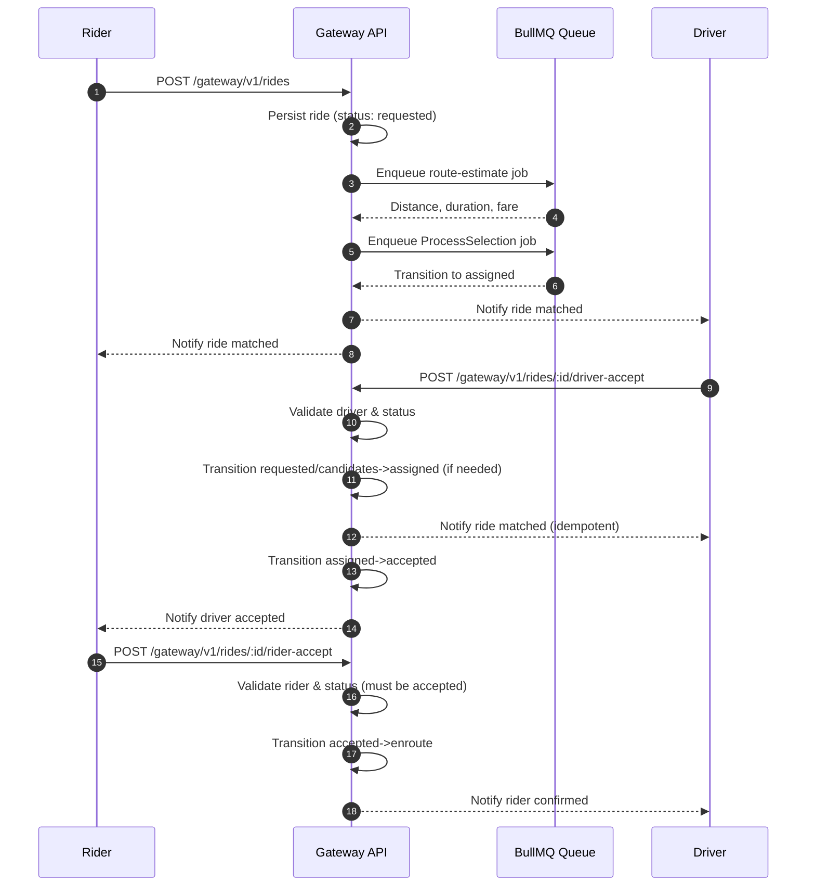

# Ride Creation-to-Acceptance Flow

The diagram traces how the gateway coordinates ride creation, background queue processing, and the mutual handshake between driver and rider before the trip starts.

## Handling multiple driver candidates

The current workflow always targets a **single** driver per ride:

* `CreateRideDto` requires a `driverId`, so a ride is created with exactly one intended driver rather than a pool of candidates.
* The queue workflow (`RideProcessor.handleRideWorkflow`) and driver acceptance endpoint both transition the ride to `ASSIGNED` for that specific `driverId` and then send a `ride.matched` notification to that same driver.
* Subsequent notifications (`ride.driver.accepted`, `ride.rider.confirmed`, and cancellation events) also look up the single `driverId` on the ride entity, so there is no fan-out to other drivers and no concept of notifying “losing” candidates.

To support several eligible drivers you would need additional state (for example, a candidate table or an array of `driverIds`) plus explicit notification fan-out. Each candidate would require its own channel via `NotificationPublisher.emit('driver', candidateId, ...)`, and once one driver accepts you would send a follow-up notification to the remaining candidates telling them the offer was withdrawn before clearing their pending jobs. None of that logic exists in the current codebase, so today only the pre-selected driver is ever contacted or updated about the ride.
